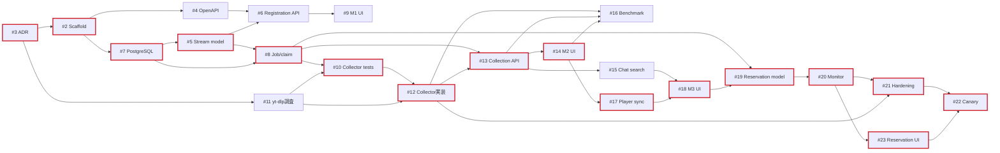

# Issue #1 実装タスク実行計画

対象: [#1 Reimplement Stream Analysis Tools core (M0-M4.1)](https://github.com/tsumasaki-kurageya/stream-analysis-tools/issues/1)  
作成日: 2026-08-09  
対象範囲: Open状態の子Issue #2〜#23

## 1. 結論

- 実装は下記の15 Waveで進める。1 Wave内のIssueは並行実装できる。
- 推奨同時実行数は最大2 Issueとする。基盤が固まる前に3本以上を走らせると、migration、OpenAPI、生成コードの競合コストが高い。
- Issueごとに独立PRを作り、依存先PRがmainへmergeされてから依存Issueをmergeする。
- 最長の依存列（クリティカルパス）は2本あり、末尾だけが分岐する。`#3 → #2 → #7 → #5 → #8 → #10 → #12 → #13 → #14 → #17 → #18 → #19 → #20` までは共通で、`#21 → #22` と `#23 → #22` に分かれる。
- #16は後続Issueの宣言上の依存先ではないが、Issue #1の非交渉条件によりM2完了ゲートである。#17以降の開発は並行してよいが、#16成功前にM2を完了扱いにしない。

## 2. 推奨実行順

| Wave | 並行して進めるIssue | 主な担当領域 | 開始条件 | Waveの合流条件 |
|---:|---|---|---|---|
| 0 | [#3 ADR](https://github.com/tsumasaki-kurageya/stream-analysis-tools/issues/3) | Architecture / Docs | なし | yt-dlp-first、PostgreSQL source of truth、対象外機能が合意済み |
| 1 | [#2 Scaffold](https://github.com/tsumasaki-kurageya/stream-analysis-tools/issues/2) ・ [#11 yt-dlp characterization](https://github.com/tsumasaki-kurageya/stream-analysis-tools/issues/11) | Platform ・ Worker research | #3 | toolchainの骨格と、固定するyt-dlp仕様が判明 |
| 2 | [#4 OpenAPI/codegen](https://github.com/tsumasaki-kurageya/stream-analysis-tools/issues/4) ・ [#7 PostgreSQL](https://github.com/tsumasaki-kurageya/stream-analysis-tools/issues/7) | Contract/CI ・ Infrastructure | #2 | 生成コード検査とDB readinessが利用可能 |
| 3 | [#5 Stream schema/repository](https://github.com/tsumasaki-kurageya/stream-analysis-tools/issues/5) | Main API / DB | #7 | Stream永続化契約とintegration testが安定 |
| 4 | [#6 Registration API](https://github.com/tsumasaki-kurageya/stream-analysis-tools/issues/6) ・ [#8 Job schema/claim loop](https://github.com/tsumasaki-kurageya/stream-analysis-tools/issues/8) | Main API ・ Worker/DB | #6: #4, #5 / #8: #7, #5 | M1 APIとM2 job基盤を個別に検証済み |
| 5 | [#9 M1 UI](https://github.com/tsumasaki-kurageya/stream-analysis-tools/issues/9) ・ [#10 Collector interface tests](https://github.com/tsumasaki-kurageya/stream-analysis-tools/issues/10) | Web ・ Worker tests | #9: #6 / #10: #8, #11 | M1 E2E成功、collectorの失敗テストが仕様を固定 |
| 6 | [#12 yt-dlp adapter/parser/upsert](https://github.com/tsumasaki-kurageya/stream-analysis-tools/issues/12) | Worker / DB | #10, #11 | interface testがgreen、長時間fixtureがbounded memoryで成功 |
| 7 | [#13 Collection/chat API](https://github.com/tsumasaki-kurageya/stream-analysis-tools/issues/13) | Main API / Contract | #8, #12 | idempotent start、status、retry、paginationをintegration test済み |
| 8 | [#14 M2 UI](https://github.com/tsumasaki-kurageya/stream-analysis-tools/issues/14) ・ [#15 Chat search](https://github.com/tsumasaki-kurageya/stream-analysis-tools/issues/15) | Web ・ Main API/DB | #14: #13 / #15: #13 | 収集閲覧E2Eと検索integration testが成功 |
| 9 | [#16 Performance benchmark](https://github.com/tsumasaki-kurageya/stream-analysis-tools/issues/16) ・ [#17 Player sync](https://github.com/tsumasaki-kurageya/stream-analysis-tools/issues/17) | Verification ・ Web | #16: #12, #13, #14 / #17: #14 | M2性能結果を記録、player/chat同期E2E成功 |
| 10 | [#18 M3 UI](https://github.com/tsumasaki-kurageya/stream-analysis-tools/issues/18) | Web | #17, #15 | 検索→seek→同期再生のM3 demo成功 |
| 11 | [#19 Reservation model](https://github.com/tsumasaki-kurageya/stream-analysis-tools/issues/19) | Main API / DB | #8, #18 | state transitionと一意制約を検証済み |
| 12 | [#20 Reservation monitor](https://github.com/tsumasaki-kurageya/stream-analysis-tools/issues/20) | Worker / DB | #19 | restart、multi-worker、exactly-once job作成を検証済み |
| 13 | [#21 Observability/hardening](https://github.com/tsumasaki-kurageya/stream-analysis-tools/issues/21) ・ [#23 Reservation UI](https://github.com/tsumasaki-kurageya/stream-analysis-tools/issues/23) | Platform/Worker ・ Web | #21: #12, #20 / #23: #20 | secret audit成功、予約E2E成功 |
| 14 | [#22 Canary/rollback](https://github.com/tsumasaki-kurageya/stream-analysis-tools/issues/22) | Production verification | #21, #23 | canary、restart recovery、rollback rehearsalの報告書が完成 |

## 3. 依存関係

実線はGitHub Issueに宣言された依存関係である。太い経路がクリティカルパス。

## 4. 並行実装のルール

### 安全に並行できる組み合わせ

| 組み合わせ | 並行できる理由 | 先に合わせる契約 |
|---|---|---|
| #2 と #11 | repository scaffoldと外部ツール調査で成果物が分離 | #3 ADR |
| #4 と #7 | OpenAPI/CIとDB runtimeで変更箇所が分離 | #2のdirectory、共通コマンド名 |
| #6 と #8 | registration APIとjob claimは別module | #5 Stream repository、migration採番 |
| #9 と #10 | Web UIとWorker interface testsで分離 | #6 API contract、#11 fixture形式 |
| #14 と #15 | Webの収集閲覧とDB/API検索で分離 | #13 pagination/offset contract |
| #16 と #17 | benchmark/verificationとplayer UIで分離 | #14の完成状態、同じ実データfixture |
| #21 と #23 | observability/cleanupとreservation UIで概ね分離 | #20 state/error contract |

### 直列にする箇所

- #3 → #2: deployment unitと責務を確定してからdirectoryを固定する。
- #5 → #6/#8: Stream schemaとrepositoryを2系統の利用側より先に安定させる。
- #10 → #12: collectorの外部契約とfailure behaviorをtest-firstで固定する。
- #12 → #13 → #14: Workerの永続化結果、HTTP表現、UI表現を下流へ順に流す。
- #17/#15 → #18: player同期と検索の両方が揃ってから統合UIを作る。
- #19 → #20: reservation state machineをmonitor実装より先に固定する。
- #20 → #21/#23: monitoring/collection errorの意味をhardeningとUIで共有する。
- #21/#23 → #22: 観測・redactionと操作UIが揃うまでproduction queueを有効化しない。

## 5. マイルストーン完了ゲート

Issueの着手は前倒しできるが、次の条件を満たすまでマイルストーンを完了扱いにしない。

| Gate | 必須Issue | 判定 |
|---|---|---|
| M0 | #3, #2, #7, #4 | clean checkoutから全unitをformat、lint、type-check、buildでき、PostgreSQLがreadyになる |
| M1 | #5, #6, #9 | 実在する終了済み配信を登録し、再起動後に一覧・詳細を開ける |
| M2 | #8, #11, #10, #12, #13, #14, #16 | 長時間chatを冪等収集でき、UIで状態を確認でき、直接yt-dlp比較の性能gateを通過する |
| M3 | #17, #15, #18 | 検索結果からseekし、再生中のchat同期を維持できる |
| M4 | #19, #20, #23 | 予約からarchive-ready後の自動収集を一度だけ起動し、再起動から回復できる |
| M4.1 | #21, #22 | secret漏えいなし、temp cleanup、canary、rollback rehearsalを証跡付きで完了する |

## 6. PRとmerge運用

1. 1 Issue = 1 PRを基本とし、IssueのCompletion evidenceをPR本文のチェックリストへ転記する。
2. 依存先PRをmainへmergeしてから、依存PRを最新mainへ追従させる。
3. 同一WaveのPRは並行作業できるが、共通契約の変更は先に小さなcontract commitとして合流する。
4. migrationを並行追加するWave 4とWave 13では、採番とdown/up順をPR作成時に予約する。
5. OpenAPI変更では生成されたGo/TypeScriptのdrift checkを必須にする。手編集しない。
6. Worker、API、Webの境界テストを先にmergeし、内部実装の詳細を他unitへ漏らさない。
7. 各Gateでcompletion demoまたはreportを保存し、次Gateの回帰基準にする。

## 7. 実行チェックリスト

### M0

- [ ] [#3 ADR](https://github.com/tsumasaki-kurageya/stream-analysis-tools/issues/3)
- [ ] [#2 Scaffold](https://github.com/tsumasaki-kurageya/stream-analysis-tools/issues/2)
- [ ] [#7 PostgreSQL](https://github.com/tsumasaki-kurageya/stream-analysis-tools/issues/7)
- [ ] [#4 OpenAPI/codegen](https://github.com/tsumasaki-kurageya/stream-analysis-tools/issues/4)

### M1

- [ ] [#5 Stream schema/repository](https://github.com/tsumasaki-kurageya/stream-analysis-tools/issues/5)
- [ ] [#6 Metadata preview/registration](https://github.com/tsumasaki-kurageya/stream-analysis-tools/issues/6)
- [ ] [#9 Registration/list/detail UI](https://github.com/tsumasaki-kurageya/stream-analysis-tools/issues/9)

### M2

- [ ] [#8 Collection job/claim loop](https://github.com/tsumasaki-kurageya/stream-analysis-tools/issues/8)
- [ ] [#11 yt-dlp characterization/version pin](https://github.com/tsumasaki-kurageya/stream-analysis-tools/issues/11)
- [ ] [#10 Collector interface tests](https://github.com/tsumasaki-kurageya/stream-analysis-tools/issues/10)
- [ ] [#12 Adapter/parser/bulk upsert](https://github.com/tsumasaki-kurageya/stream-analysis-tools/issues/12)
- [ ] [#13 Collection/status/chat API](https://github.com/tsumasaki-kurageya/stream-analysis-tools/issues/13)
- [ ] [#14 Collection progress/chat UI](https://github.com/tsumasaki-kurageya/stream-analysis-tools/issues/14)
- [ ] [#16 Direct yt-dlp benchmark](https://github.com/tsumasaki-kurageya/stream-analysis-tools/issues/16)

### M3

- [ ] [#17 Player synchronization/seek](https://github.com/tsumasaki-kurageya/stream-analysis-tools/issues/17)
- [ ] [#15 PostgreSQL chat search](https://github.com/tsumasaki-kurageya/stream-analysis-tools/issues/15)
- [ ] [#18 Synchronized exploration UI](https://github.com/tsumasaki-kurageya/stream-analysis-tools/issues/18)

### M4

- [ ] [#19 Reservation schema/state machine](https://github.com/tsumasaki-kurageya/stream-analysis-tools/issues/19)
- [ ] [#20 Reservation monitor/job creation](https://github.com/tsumasaki-kurageya/stream-analysis-tools/issues/20)
- [ ] [#23 Reservation UI](https://github.com/tsumasaki-kurageya/stream-analysis-tools/issues/23)

### M4.1

- [ ] [#21 Observability/redaction/cleanup](https://github.com/tsumasaki-kurageya/stream-analysis-tools/issues/21)
- [ ] [#22 Production canary/rollback](https://github.com/tsumasaki-kurageya/stream-analysis-tools/issues/22)

## 8. 変更時の更新ルール

- 子IssueのDependenciesを変更したら、Wave表、Mermaid、クリティカルパスを同じPRで更新する。
- 新しいIssueを追加したら、親Issue #1のmilestone checklistとこの計画の両方へ追加する。
- 実測で競合が多い組み合わせは並行対象から外す。逆に独立性がinterface testで証明できた場合のみ並列度を上げる。
- M2のyt-dlp benchmark、M4のrestart recovery、M4.1のrollbackは省略不可のGateとして維持する。
