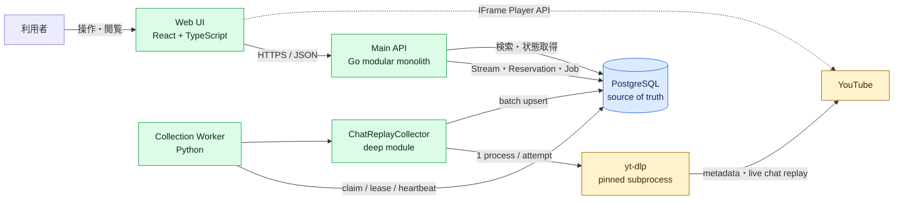
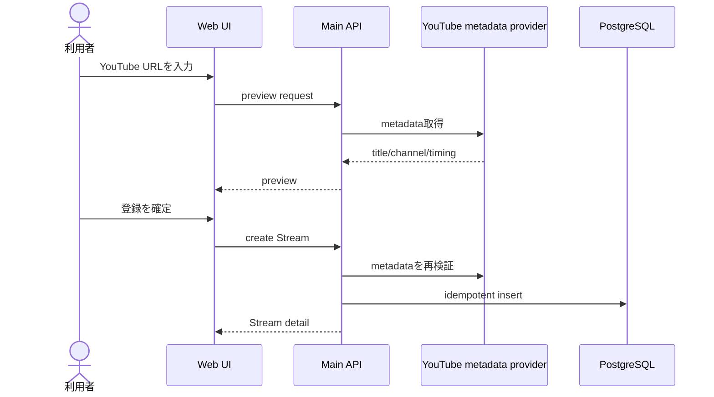
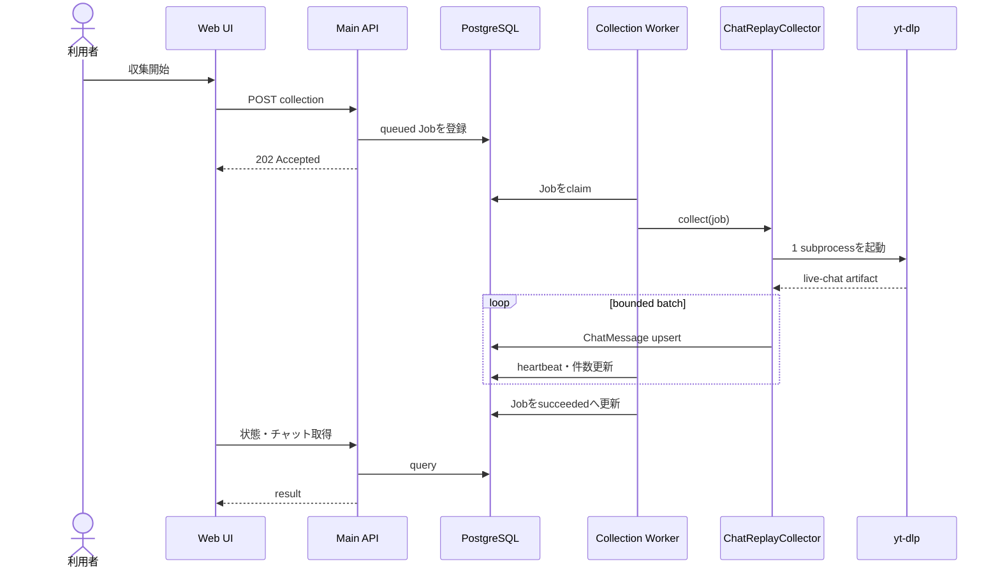
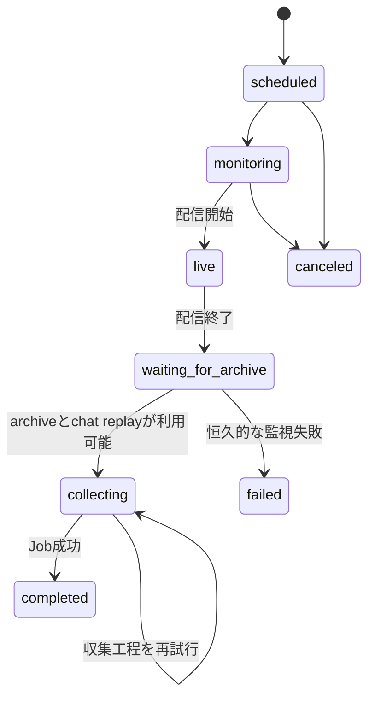

# Stream Analysis Tools 再実装計画

- Status: Proposed
- Created: 2026-08-09
- Scope: M1〜M4相当のコアシステム再構築

## 1. 目的

終了済みまたは配信中のYouTube配信を登録し、配信メタデータとチャットリプレイを収集して、動画時刻と同期しながら探索できるシステムを再実装する。

最初の完成範囲は次の4段階とする。

1. 終了済み配信を登録し、一覧・詳細で確認できる
2. チャットリプレイをバックグラウンド取得し、時系列で閲覧できる
3. YouTubeプレーヤーとチャットを同期し、チャット検索から場面へ移動できる
4. 配信を事前予約し、終了後に自動収集できる

チャットリプレイ取得はシステム全体の一工程であり、製品全体の目的ではない。

## 2. 前回実装からの教訓

前回は、yt-dlpが持つチャットリプレイ取得処理を利用せず、YouTube内部レスポンス、continuation、ページング、待機を独自実装した。その結果、Workerへ責務が集中し、長時間配信で低パフォーマンスになったため実装を破棄した。

再実装では次を設計上の制約とする。

- YouTubeへのチャットリプレイ取得、continuation処理、ページ送りはyt-dlpへ委譲する
- 独自Innertube clientを作らない
- Workerはジョブ制御、yt-dlp実行、成果物の正規化、バルク保存だけを担当する
- 直接yt-dlpを実行した場合との性能比較をM2の完了条件にする
- YouTube内部仕様の知識をWorker全体へ拡散させない
- yt-dlpは完全固定したversionで運用し、更新時に実データcanaryを行う

## 3. Target state

利用者はWeb UIだけで次を完了できる。

- YouTube URLから配信情報をpreviewして登録する
- 登録済み配信の一覧と詳細を確認する
- 終了済み配信のチャット収集を開始し、進捗と失敗理由を確認する
- 動画再生時刻と同期したチャットを閲覧・検索する
- 配信前または配信中に予約を作成し、終了後の自動収集を待つ
- Workerやアプリケーションを再起動しても登録、予約、ジョブを継続する

## 4. システム構成図



### 4.1 デプロイ単位

初版は次の4単位とする。

- Web UI
- Main API
- Collection Worker
- PostgreSQL

yt-dlpは独立HTTP Gatewayにせず、Collection Worker container内で固定versionのsubprocessとして実行する。Gateway分離は、更新頻度、権限、負荷、障害分離の必要性が実測された場合だけ再検討する。

### 4.2 責務

| Module | 責務 | 担当しないこと |
|---|---|---|
| Web UI | 登録、状態表示、同期閲覧、検索、予約操作 | YouTube取得、ジョブ実行 |
| Main API | HTTP interface、入力検証、Stream・Reservation・Job管理 | 長時間収集、yt-dlp実行 |
| Collection Worker | Job claim、lease、heartbeat、収集工程の実行 | UI向けHTTP、独自YouTube pagination |
| ChatReplayCollector | yt-dlp実行、成果物検証、正規化、バッチ保存 | continuation生成、YouTube再問い合わせ |
| PostgreSQL | 全永続データとジョブ状態の正本 | 外部データ取得 |

## 5. 主要処理フロー

### 5.1 終了済み配信の登録



preview結果をそのまま信用せず、登録時に再検証する。同じYouTube video IDは重複登録しない。

### 5.2 手動収集



### 5.3 予約後の自動収集



Reservationは長寿命監視、CollectionJobは収集実行を表す。監視失敗と収集失敗を混同しない。

## 6. Module design

### 6.1 Main API

Goのmodular monolithとして実装し、次のdomain moduleを持つ。

- Streams
- Collections
- Chat
- Reservations

module間の呼び出しはin-processとし、初版で内部moduleをmicroservice化しない。OpenAPIを外部interfaceの正本とし、生成型をWeb UIとMain APIで利用する。

### 6.2 Collection Worker

Workerの外部interfaceはPostgreSQLのJob契約とする。Job種別ごとの実装詳細をclaim loopへ漏らさない。

```text
JobRunner.run(job, cancellation) -> JobResult
```

ChatReplayCollectorはWorker内部のdeep moduleとし、次の小さなinterfaceを持つ。

```text
ChatReplayCollector.collect(request, cancellation) -> CollectionResult
```

yt-dlp process executionはtrue external dependencyなので内部seamを置き、production adapterとscripted test adapterを用意する。

### 6.3 yt-dlp-first chat replay acquisition

YouTubeへの通信、continuation取得、ページ送りはyt-dlpだけが担当する。アプリケーション側のparserは、yt-dlpが取得済みの成果物を読むだけで、YouTubeへ追加requestを送らない。

固定versionに対する初期command候補:

```text
yt-dlp
  --ignore-config
  --skip-download
  --write-subs
  --sub-langs live_chat
  --no-progress
  --paths <job-specific-temp-dir>
  --output <controlled-template>
  <canonical-youtube-url>
```

実装前のcharacterization spikeで、採用version、option名、成果物名、成果物形式、終了codeを固定する。通常stdoutは機械契約として解析しない。

ChatReplayCollectorのinterface:

```text
collect(request, cancellation) -> CollectionResult

request:
  collection job ID
  stream ID
  canonical YouTube URL
  attempt
  deadline

result:
  outcome: succeeded | no_data
  saved message count
  duplicate count
  skipped action count
  artifact bytes
  yt-dlp version
  duration
```

成果物parserが担当するもの:

- JSON/JSONLの構文検証
- message ID、author、text、published time、offsetの抽出
- 対応済みaction typeの正規化
- 未対応action typeのskipと件数記録
- 全件をmemoryへ保持しないstream処理
- 500件を初期値とするbounded batchの生成

成果物parserが担当しないもの:

- continuationの生成、復号、検証
- 次ページURLの組み立て
- YouTubeへの再問い合わせ
- yt-dlpが取得しなかったページの補完

性能完了条件:

- 1 attemptにつきyt-dlp processを1回だけ起動する
- Worker自身からYouTubeへの追加HTTP requestは0件
- 長時間配信で、Worker全体時間をdirect yt-dlp時間の1.25倍 + 60秒以内にする
- peak RSSを512 MiB未満に保つ
- PostgreSQLはbulk upsertし、1 message 1 transactionを禁止する

安全性:

- yt-dlp versionとchecksumを固定する
- shell command文字列ではなく引数配列で起動する
- `--ignore-config`を必須にする
- 任意の`--exec`、output template、proxy、cookie pathを利用者入力から受け取らない
- Cookie、Authorization、chat本文、command全文をlogへ出さない
- job固有temp directoryは成功、no_data、恒久失敗後に削除する

代表的なerror分類:

| code | retryable | 意味 |
|---|---:|---|
| `CHAT_REPLAY_NOT_AVAILABLE` | false | chatなし、replay無効 |
| `SOURCE_NOT_READY` | true | archive準備中 |
| `YOUTUBE_ACCESS_DENIED` | false | 非公開、Cookie不足 |
| `YOUTUBE_RATE_LIMITED` | true | rate limit |
| `YTDLP_TIMEOUT` | true | deadline超過 |
| `YTDLP_PROCESS_FAILED` | 判定による | 非0終了かつ既知分類不能 |
| `YTDLP_OUTPUT_CHANGED` | false | 成果物schemaの非互換変更 |
| `CHAT_IMPORT_FAILED` | true | DBまたは一時I/O障害 |

独自取得実装へのfallbackは用意しない。障害時は停止するか、characterization済みの直前yt-dlp versionへrollbackする。

### 6.4 PostgreSQL

初版ではDBを分割しない。schemaで責務を分ける。

- `stream`: 配信情報
- `collection`: Job、Step
- `chat`: 正規化済みChatMessage
- `reservation`: 予約と状態遷移

ジョブqueueにはPostgreSQLと`FOR UPDATE SKIP LOCKED`を利用する。Redis、RabbitMQ、Celeryは、実測でPostgreSQL方式が不足するまで導入しない。

## 7. Data model

### Stream

- internal UUID
- unique YouTube video ID
- canonical URL
- title、channel、thumbnail
- scheduled/actual start time
- actual end time
- duration
- lifecycle status
- metadata fetched at

### CollectionJob

- stream ID
- kind
- status
- attempt
- worker/lease/heartbeat
- processed/skipped count
- stable error code/message
- timestamps

初版の標準工程は`metadata`と`chat_replay`だけとする。動画、音声、字幕工程を追加しない。

### ChatMessage

- stream ID
- source message ID
- author ID/name
- message text
- published time
- offset milliseconds
- message type

unique `(stream_id, source, source_message_id)`と、閲覧用index `(stream_id, offset_milliseconds, id)`を持つ。

### Reservation

- YouTube video ID
- status
- next check time
- retry count
- worker/lease/heartbeat
- stream ID nullable
- collection job ID nullable
- error classification

active reservationのvideo IDと、Reservation由来CollectionJobを一意にする。自動Job作成、Job参照設定、`collecting`遷移は同じtransactionで行う。

## 8. HTTP interface

初期interface:

- `POST /streams/preview`
- `POST /streams`
- `GET /streams`
- `GET /streams/{streamId}`
- `POST /streams/{streamId}/collections`
- `GET /streams/{streamId}/collections/latest`
- `POST /collection-jobs/{jobId}/retry`
- `GET /streams/{streamId}/chat-messages`
- `GET /streams/{streamId}/chat-search`
- `POST /reservations`
- `GET /reservations`
- `GET /reservations/{reservationId}`
- `POST /reservations/{reservationId}/cancel`

エラーはRFC 9457 Problem Detailsへ統一し、安定した`code`、`retryable`、`requestId`を含める。yt-dlpのstderrや内部optionをHTTP interfaceへ露出しない。

## 9. UI

### 配信登録

- YouTube URL入力
- metadata preview
- 入力、取得、重複登録エラー

### 配信一覧・詳細

- metadataとcollection status
- 収集開始と工程別再試行
- YouTube埋め込みplayer
- 再生時刻周辺のchat
- chat選択・検索結果からseek

### 予約

- 予約作成
- scheduled、monitoring、live、waiting、collecting、completed、failed、canceledの表示
- cancelと失敗理由表示

処理中だけpollingし、未実装のリアルタイム収集、字幕、動画保存、AI分析は画面へ出さない。

## 10. 実装マイルストーン

### M0: Foundations

完成状態:

- monorepo、CI、Docker Compose、OpenAPI、migration、loggingの最小構成がある
- Web UI、Main API、Worker、PostgreSQLを1コマンドで起動できる
- yt-dlp利用と旧独自取得方式の却下をADRに記録している

### M1: Stream registration

完成状態:

- 終了済み実配信をpreviewして登録できる
- 一覧と詳細を再起動後も閲覧できる
- 不正URL、取得不能、重複を判別できる

### M2: Background chat collection

完成状態:

- Workerがyt-dlpで数時間規模の実配信を処理できる
- 状態と件数をUIで確認できる
- 再実行しても重複しない
- 直接yt-dlp基準に対する性能gateを満たす

### M3: Synchronized exploration

完成状態:

- Player時刻とchatがoffset millisecondsで同期する
- chatを選択して該当時刻へseekできる
- 文字列検索結果から場面を再生できる

### M4: Reservations

完成状態:

- 配信前/配信中URLを予約できる
- archive準備後にM2収集を一度だけ自動起動する
- Worker再起動と一時的YouTube障害から回復できる

### M4.1: Production hardening

完成状態:

- Railway等の検証環境でM1〜M4を実データ完走できる
- secret rotation、redaction、backup、monitoring、rollback手順がある

## 11. Implementation tasks and dependencies

各行を独立した小さなcommitまたはPRとする。

| Order | Task | Depends on | Completion evidence |
|---:|---|---|---|
| 1 | system architectureとyt-dlp-first取得のADRを追加 | None | Accepted ADR |
| 2 | monorepo directoryとtoolchainをscaffold | 1 | clean build |
| 3 | Docker ComposeでPostgreSQLを起動 | 2 | readiness check |
| 4 | OpenAPI lint/codegenをCIへ追加 | 2 | generated types + CI |
| 5 | Stream migrationとrepositoryを追加 | 3 | integration test |
| 6 | metadata preview/register interfaceを追加 | 4, 5 | API test |
| 7 | M1 UIを追加 | 6 | browser E2E |
| 8 | CollectionJob/Step migrationとclaim loopを追加 | 3, 5 | multi-worker test |
| 9 | yt-dlp characterization spikeとversion pinを実施 | 1 | benchmark report |
| 10 | ChatReplayCollector interface testを追加 | 8, 9 | red test |
| 11 | yt-dlp adapter、parser、bulk upsertを実装 | 10 | green interface test |
| 12 | M2 collection/status/chat interfaceを追加 | 8, 11 | API integration test |
| 13 | M2 UIを追加 | 12 | browser E2E |
| 14 | direct yt-dlp comparison benchmarkを実施 | 11-13 | performance gate |
| 15 | Player syncとseekを追加 | 13 | playback E2E |
| 16 | PostgreSQL chat searchを追加 | 12 | search integration test |
| 17 | M3 UIを完成 | 15, 16 | M3 completion demo |
| 18 | Reservation migrationとstate machineを追加 | 8, 17 | state transition test |
| 19 | Reservation monitorとtransactional Job creationを追加 | 18 | restart/idempotency test |
| 20 | M4 UIを追加 | 19 | browser E2E |
| 21 | observability、redaction、cleanupを追加 | 11, 19 | failure-path test |
| 22 | production canaryとrollback rehearsalを実施 | 20, 21 | completion report |

## 12. Test strategy

### Module tests

- domain moduleのinterfaceから振る舞いを検証する
- ChatReplayCollectorはscripted yt-dlp adapterと匿名化fixtureを使う
- interfaceより内側の実装詳細を固定するtestを増やさない

### Integration tests

- PostgreSQLはTestcontainersを使う
- Job claim、lease expiry、heartbeat、multi-worker、idempotent upsertを検証する
- OpenAPI contractと生成clientを同じCIで検証する

### Browser E2E

- Stream登録
- 手動収集とstatus polling
- chat閲覧、検索、player seek
- Reservation作成から自動収集完了

### Real-data verification

- 短時間・少量chat
- 長時間・大量chat
- chat replayなし
- access deniedまたはCookie必要
- archive準備中

通常CIでは外部YouTubeへ接続しない。release前、yt-dlp更新時、production canaryでのみ実行する。

## 13. Completion demonstration

1. 1コマンドで全deploy単位を起動する。
2. 終了済み実配信をpreview、登録、一覧・詳細表示する。
3. chat収集を開始し、Workerがyt-dlpを1回だけ実行することを確認する。
4. 進捗、完了件数、chat一覧を確認する。
5. chatを選択し、YouTube playerが該当時刻へ移動することを確認する。
6. chat検索結果から場面を再生する。
7. 再収集し、messageが重複しないことを確認する。
8. 配信予約を作り、終了後に自動収集されることを確認する。
9. Workerを処理中に再起動し、lease recovery後に完了することを確認する。
10. direct yt-dlpとの性能比較、secret redaction、rollback結果をreportへ残す。

## 14. Excluded work

コア再構築では次を実装しない。

- 配信中chatのリアルタイム収集
- 動画、音声、字幕、transcriptの取得・保存
- 注目区間の自動判定
- 複数配信視点の比較
- context収集とAI分析
- 切り抜き候補管理
- calendar連携
- 独立YouTube Data Gateway

これらはM1〜M4の実データ完了後に、M5以降として別計画を作る。

## 15. Unresolved items

- Web/Main APIのmetadata providerにYouTube Data APIを使うか、yt-dlp metadataを再利用するか
- Cookieが必要な配信を初版の対象に含めるか
- production deploy先とsecret管理方式
- 実データbenchmarkに利用する固定配信
- chat searchを単純部分一致から開始するか、PostgreSQL全文検索から開始するか

推奨defaultは、metadataはYouTube Data API、chat replayはyt-dlp、検索は単純部分一致、raw artifactは保存しない、とする。

## 16. 参照

- [yt-dlp README](https://github.com/yt-dlp/yt-dlp/blob/master/README.md)
- [yt-dlp releases](https://github.com/yt-dlp/yt-dlp/releases)
- `old_docs/architecture.md`
- `old_docs/development-milestones.md`
- `old_docs/decisions/0001-m1-stream-metadata-acquisition.md`
- `old_docs/decisions/0002-m2-background-collection-job-model.md`
- `old_docs/decisions/0004-m4-reservation-state-machine.md`
- `old_docs/decisions/0005-discontinue-media-and-transcript-collection.md`
